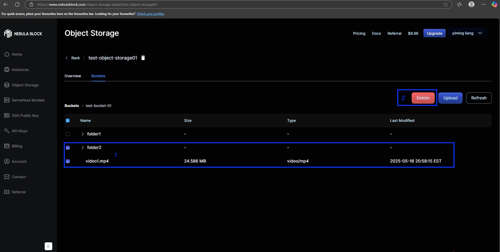
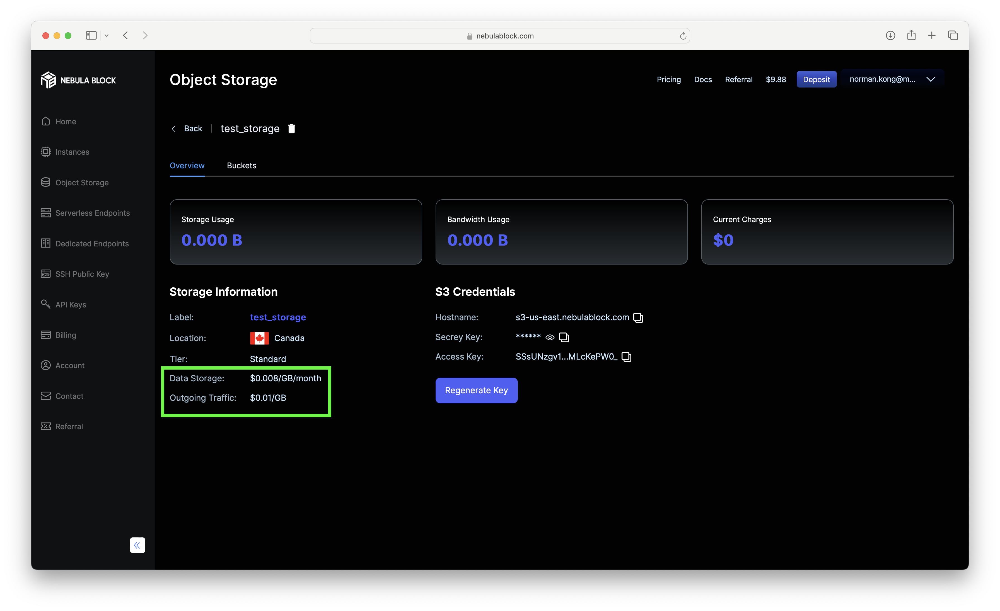

# Starting Your Object Storage 

1. Navigate to the **Object Storage** tab **(1)**, and click **Deploy** **(2)**.

    
2. Select your configuration, a **unique name** and click **Create**.

    > **Note:** The name of object storage should not contain a space.
 
    
3. Your new storage deployment should now appear in the list. Click **View** to check the details of the object storage

    
4. The object storage information contains your usage status, billing info and s3 keys info. 
   You can use the key and s3cmd to access your object storage

    
      [S3cmd set up for Linux/Mac](Tutorials/LinuxMac.md)
      [S3cmd set up for Linux/Mac](Tutorials/Windows.md)

> **Note:** Storage names are account-unique.

# Create Your Bucket

1. Navigate to the **Buckets** tab **(1)**, and then click **Create Bucket** **(2)**.
   
   
2. Type in your bucket name.
   
   
   > **Note:** Bucket names must be globally unique. If s3cmd fails to create one, try another name.  
   > Bucket name should follow these rules:  
   >- Only lowercase letters (`a-z`), numbers (`0-9`), and hyphens (`-`) are allowed  
   >- Must begin with a letter or number  
   >- Length must be between **3 to 63 characters**  
   >- Cannot contain uppercase letters, underscores (`_`), spaces, or other special characters  
   >- Avoid starting or ending with a hyphen (`-`)
3. Once the bucket name meets the requirements, it will appear in the list below.
   
   

# Upload Your File

1. In the bucket view, you can upload files by clicking the **Upload** button **(1)**. Next, click the **Upload File** button **(2)** to select a file from your 
   local system. Finally, click the **Upload** button **(3)** to upload the selected file to your bucket.
   
   

   > **Note:** The file size must not exceed **50 MB**.  
   > Folder and multiple file upload features are coming soon.  
   > For now, please use **s3cmd** to upload entire folders.
2. File has been uploaded successfully.
   
   

3. If your bucket already contains folders, you can customize the upload path for your file. Select **Path**, then choose the folder where you want to upload the file.

   

# Delete Your File

1. You can delete multiple files and folders in your bucket at once. Select the files and folders **(1)**, then click the **Delete** button.  
   The selected items will be permanently deleted.

   
   
   

# Delete Your Bucket
1. In the list of your buckets, you can delete a bucket by clicking the **Delete** button.
   
   
   
   
   > **Warning:** Deleting a bucket will permanently remove the bucket along with all its contents. This action cannot be undone.

# Delete Your Object Storage

To remove your storage:
1. Go to the **Object Storage** tab.
2. Click **Delete** on the deployment you want to remove. 
   
   
3. Confirm the deletion. 
   
   
4. Use the **Active** filter to view object storage that are **Ready** or **Deleted**, **Disabled**.

   

# Billing 

Your deployment shows: 

- Storage Usage: How much data you're storing.
- Bandwidth Usage: How much data has been transferred out. 
- Current Charges: The total charges incurred so far, calculated by a rate on your storage usage and a rate on your bandwidth usage. 

The values are updated hourly. To view pricing: 
- Go to your storage deployment's **Details** page. 

- Or check the pricing when selecting your configuration

