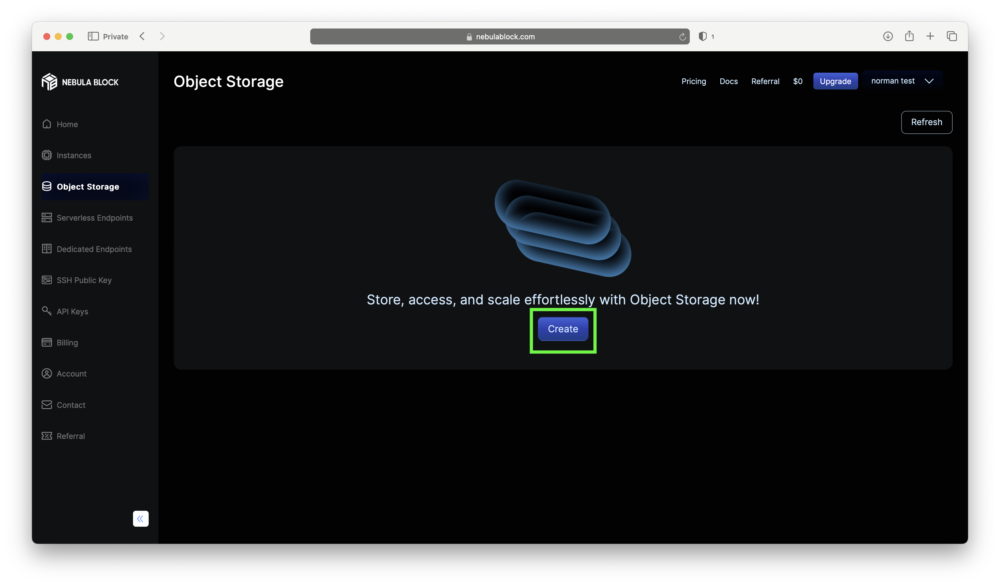
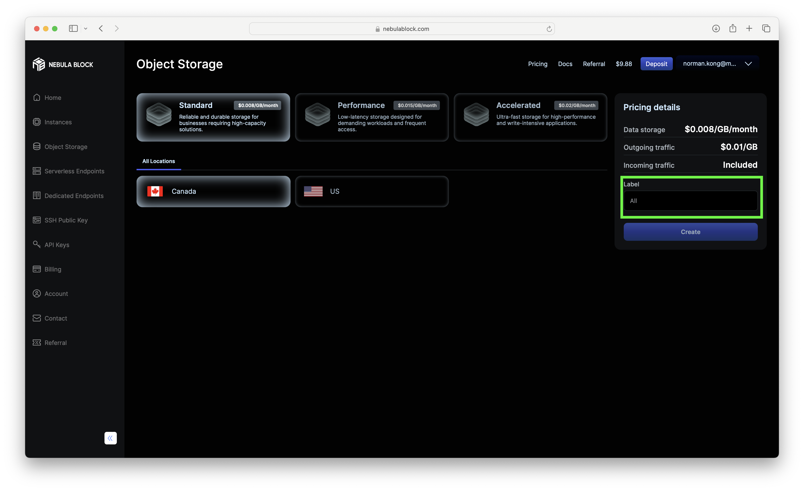
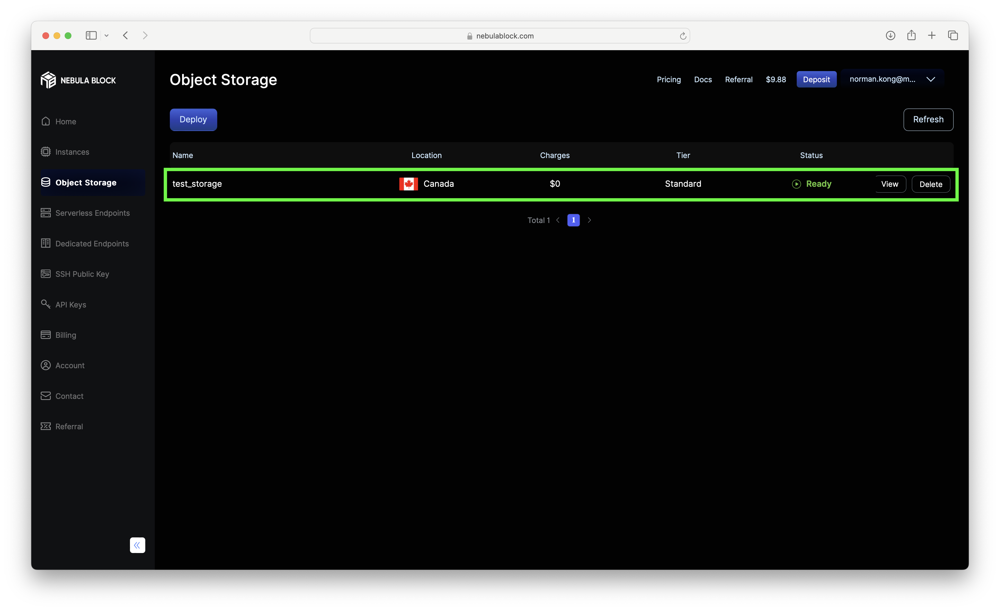

# Starting Your Deployment 

1. Navigate to the **Object Storage** tab, and click **Deploy**.

2. Select your configuration, a **unique name** and click **Create**.

3. Your new storage deployment should now appear in the list.

> **Note:** Storage names are account-unique, but S3 bucket names must be globally unique. If s3cmd fails to create one, try another name.