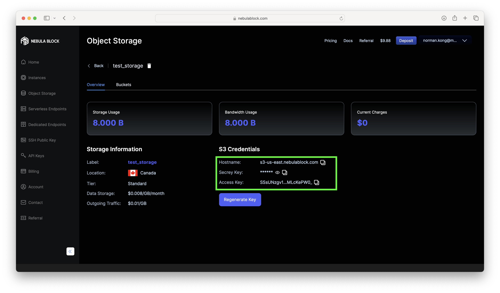

# Nebula Block Storage Python SDK Example

This example demonstrates how to connect to Nebula Block (an S3-compatible service) and perform basic operations like listing buckets, uploading, downloading, and generating a presigned URL using the AWS SDK for Python [`boto3`](https://boto3.amazonaws.com/v1/documentation/api/latest/index.html).

## Prerequisites

Before running the code, ensure you have the following:

1. Create an object storage bucket on the [Nebula Block](https://www.nebulablock.com/object-storage) platform, then navigate to the corresponding page to obtain the storage access credentials.

2. **Python** installed.
3. **boto3** and **python-dotenv** libraries installed. You can install them using pip:
   ```bash
   pip install boto3 python-dotenv
   ```
4. Create a `.env` file with your Nebula Block credentials:
   ```ini
   NEBULA_ACCESS_KEY=YOUR_ACCESS_KEY  #Use the Access Key from the Details page.
   NEBULA_SECRET_KEY=YOUR_SECRET_KEY  #Use the Secret Key from the Details page.
   NEBULA_ENDPOINT=YOUR_ENDPOINT_URL  #Use the Hostname from the Details page.
   NEBULA_REGION=YOUR_REGION          #Optional, default None.
   NEBULA_BUCKET=YOUR_BUCKET_NAME
   ```

## Python Code

### Common Usage Examples

#### Create/Delete Bucket Demo
```python
import os
import sys
import logging
import boto3
from botocore.client import Config
from dotenv import load_dotenv

# Nebula Block configuration
NEBULA_CONFIG = {
    'aws_access_key_id': os.getenv('NEBULA_ACCESS_KEY'),
    'aws_secret_access_key': os.getenv('NEBULA_SECRET_KEY'),
    'endpoint_url': f"https://{os.getenv('NEBULA_ENDPOINT')}", 
    'region_name': os.getenv('NEBULA_REGION'),
    'bucket_name': os.getenv('NEBULA_BUCKET')
}

signature_version = 's3v4' # s3v4 for bucket management, s3 for upload and downloand file

s3_client = boto3.client(
    's3',
    aws_access_key_id=NEBULA_CONFIG['aws_access_key_id'],
    aws_secret_access_key=NEBULA_CONFIG['aws_secret_access_key'],
    endpoint_url=NEBULA_CONFIG['endpoint_url'],
    region_name=NEBULA_CONFIG['region_name'],
    config=Config(signature_version=signature_version)
)

s3_client.create_bucket(Bucket=NEBULA_CONFIG['bucket_name'])
s3_client.list_buckets()
s3_client.delete_bucket(Bucket=NEBULA_CONFIG['bucket_name'])
```

### Upload/Download File Demo

```python
#!/usr/bin/env python3
import os
import sys
import logging
import boto3
from botocore.client import Config
from dotenv import load_dotenv

# Configure logging
logging.basicConfig(level=logging.INFO, format='%(asctime)s - %(name)s - %(levelname)s - %(message)s')
logger = logging.getLogger(__name__)

# Load environment variables
load_dotenv()

# Nebula Block configuration
NEBULA_CONFIG = {
    'aws_access_key_id': os.getenv('NEBULA_ACCESS_KEY'),
    'aws_secret_access_key': os.getenv('NEBULA_SECRET_KEY'),
    'endpoint_url': f"https://{os.getenv('NEBULA_ENDPOINT')}", 
    'region_name': os.getenv('NEBULA_REGION'),
    'bucket_name': os.getenv('NEBULA_BUCKET')
}

# Create an S3 client
def create_s3_client():
    try:
        s3_client = boto3.client(
            's3',
            aws_access_key_id=NEBULA_CONFIG['aws_access_key_id'],
            aws_secret_access_key=NEBULA_CONFIG['aws_secret_access_key'],
            endpoint_url=NEBULA_CONFIG['endpoint_url'],
            region_name=NEBULA_CONFIG['region_name'],
            config=Config(signature_version='s3')
        )
        return s3_client
    except Exception as e:
        logger.error(f"Error creating S3 client: {e}")
        return None

# Test connection
def test_connection(s3_client):
    try:
        s3_client.list_buckets()
        logger.info("Successfully connected to Nebula Block storage!")
        return True
    except Exception as e:
        logger.error(f"Error connecting to Nebula Block: {e}")
        return False

# Upload a file
def upload_file(s3_client, file_path, object_name=None):
    if object_name is None:
        object_name = os.path.basename(file_path)
    try:
        s3_client.upload_file(file_path, NEBULA_CONFIG['bucket_name'], object_name)
        logger.info(f"File '{file_path}' uploaded successfully as '{object_name}'!")
        return True
    except Exception as e:
        logger.error(f"Error uploading file: {e}")
        return False

# Download a file
def download_file(s3_client, object_name, file_path=None):
    if file_path is None:
        file_path = object_name
    try:
        s3_client.download_file(NEBULA_CONFIG['bucket_name'], object_name, file_path)
        logger.info(f"File '{object_name}' downloaded successfully to '{file_path}'!")
        return True
    except Exception as e:
        logger.error(f"Error downloading file: {e}")
        return False

# List objects in a bucket
def list_objects(s3_client, prefix=None):
    try:
        if prefix:
            response = s3_client.list_objects_v2(Bucket=NEBULA_CONFIG['bucket_name'], Prefix=prefix)
        else:
            response = s3_client.list_objects_v2(Bucket=NEBULA_CONFIG['bucket_name'])

        if 'Contents' in response:
            logger.info(f"Objects in bucket '{NEBULA_CONFIG['bucket_name']}':")
            for obj in response['Contents']:
                logger.info(f"  - {obj['Key']} ({obj['Size']} bytes)")
            return response['Contents']
        else:
            logger.info(f"No objects found in bucket '{NEBULA_CONFIG['bucket_name']}'")
            return []
    except Exception as e:
        logger.error(f"Error listing objects: {e}")
        return []

# Generate a presigned URL
def generate_presigned_url(s3_client, object_name, expiration=3600):
    try:
        url = s3_client.generate_presigned_url(
            'get_object',
            Params={'Bucket': NEBULA_CONFIG['bucket_name'], 'Key': object_name},
            ExpiresIn=expiration
        )
        return url
    except Exception as e:
        logger.error(f"Error generating presigned URL: {e}")
        return None

# Main function
def main():
    if not all(NEBULA_CONFIG.values()):
        logger.error("Missing configuration. Please check your .env file.")
        sys.exit(1)

    s3_client = create_s3_client()
    if not s3_client:
        sys.exit(1)

    if not test_connection(s3_client):
        sys.exit(1)

    test_file_path = 'test_file.txt'
    with open(test_file_path, 'w') as f:
        f.write('This is a test file for Nebula Block storage.')

    if not upload_file(s3_client, test_file_path, 'test_file.txt'):
        os.remove(test_file_path)
        sys.exit(1)

    list_objects(s3_client)

    url = generate_presigned_url(s3_client, 'test_file.txt', expiration=3600)
    if url:
        logger.info(f"Presigned URL (valid for 1 hour): {url}")

    if not download_file(s3_client, 'test_file.txt', 'downloaded_test_file.txt'):
        os.remove(test_file_path)
        sys.exit(1)

    if os.path.exists(test_file_path):
        os.remove(test_file_path)
    if os.path.exists('downloaded_test_file.txt'):
        os.remove('downloaded_test_file.txt')

    logger.info("Nebula Block storage example completed successfully!")

if __name__ == "__main__":
    main()
```

## Explanation

### Steps in the Code

1. **Credentials**:
   The program uses `boto3.client()` to authenticate with the S3-compatible service using the provided access key and secret key. Ensure to replace `YOUR_ACCESS_KEY` and `YOUR_SECRET_KEY` with your actual credentials.

2. **Client Configuration**:
   The `boto3.client()` is configured with the endpoint and region of the S3-compatible service. The `signature_version='s3v4'` ensures the use of S3 v4 signature for secure requests.

3. **Test Connection**:
   Tests if the client can successfully list the buckets to verify the connection.

4. **Create Bucket**:
   The script attempts to create the specified bucket. If the bucket already exists, it will proceed without error.

5. **Upload a File**:
   Uploads a test file from the local system to the specified bucket in Nebula Block storage.

6. **Download a File**:
   Downloads the uploaded test file from Nebula Block storage to the local system to verify successful upload.

7. **List Objects**:
   Lists all objects in the specified bucket to confirm the file was uploaded.

8. **Presigned URL Generation**:
   Generates a temporary URL for downloading the uploaded object without needing further authentication.

9. **Cleanup**:
   Deletes the local temporary test files after completing the demonstration.

## Run the Code

To run the program, simply execute the script as a standard Python application:

```bash
python your_script_name.py
```

Make sure to have the `boto3` and `python-dotenv` libraries installed and your `.env` file properly configured with your Nebula Block credentials.

---

**Note**: Ensure that you keep your access keys secure. Do not hardcode them in production code. Always use environment variables or secret managers.

