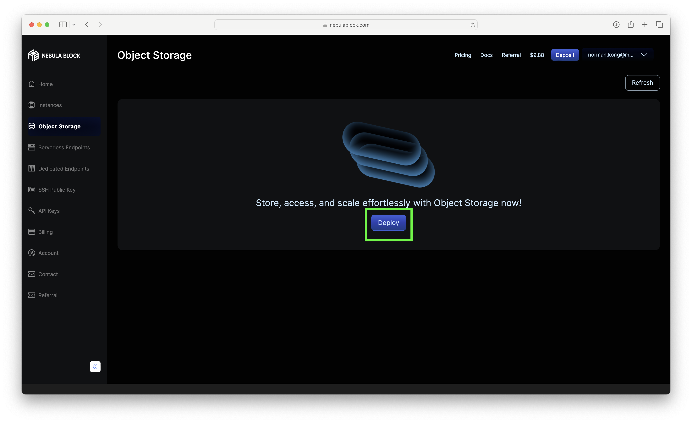
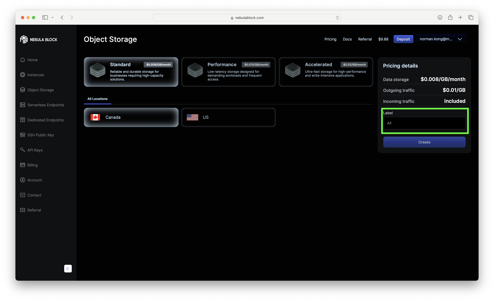
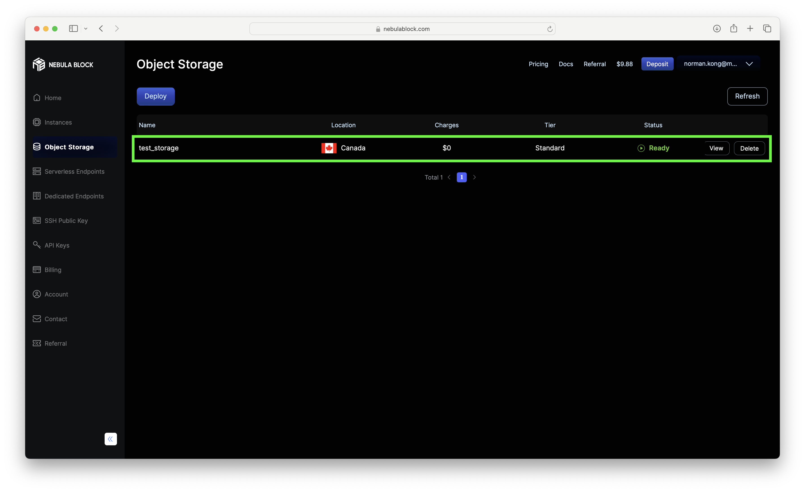
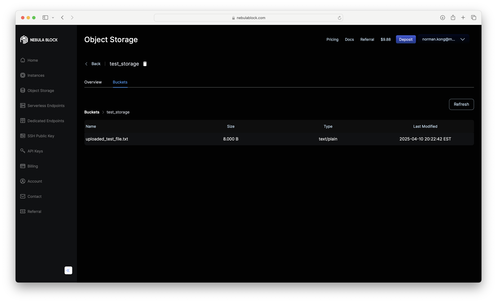
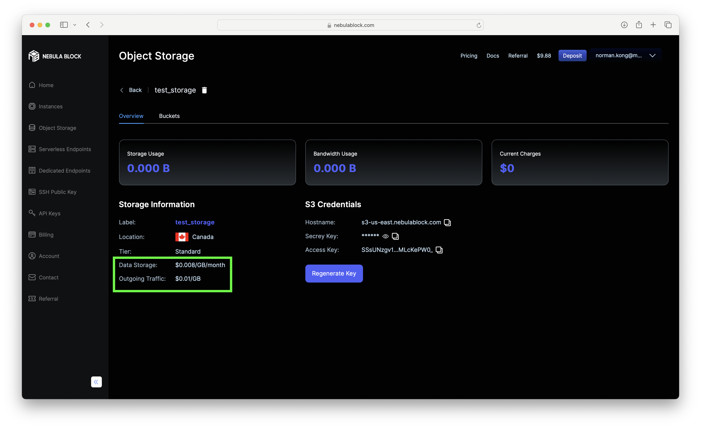
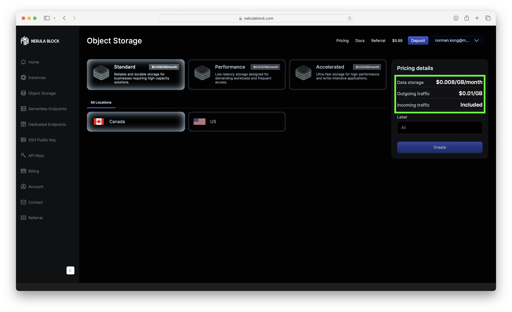

# Tutorial: Linux/Mac

### Starting Your Deployment 

1. Navigate to the **Object Storage** tab, and click **Deploy**.


2. Select your configuration, a **unique name** and click **Create**.

3. Your new storage deployment should now appear in the list.



> **Note:** The storage name must be globally unique - not just unique to your account. 

### S3 API Setup 

Our storage uses the **S3 API** (like Amazon S3). You create "buckets" to store your files, which can be accessed via URL. 

1. Install [s3cmd](https://s3tools.org/s3cmd) based on your operating system.

2. Configure `S3cmd`

    i. Open a terminal and run:
    ```bash
    s3cmd --configure
    ```
    ii. Enter the required settings when prompted. If you're not sure, **press Enter to accept the default** (shown in brackets `[]`). 

Here's what each setting means: 

- `Access Key / Secret Key`: Found on your deployment’s **Details** page. These act like your username/password for S3.
- `Default Region [US]`: The region where your storage is hosted.
- `S3 Endpoint [s3.amazonaws.com]`: Use the **Hostname** from the Details page. 
- `DNS-style bucket+hostname...`: Same as the **Hostname** above. 
- `Encryption password`: Optional. If set, your files will be encrypted before upload and decrypted on download using this password. 
- `Path to GPG program`: For encrypting files locally before upload. Leave blank unless you’ve installed and use GPG for file encryption.
- `Use HTTPS protocol [Yes]`: Leave as `Yes` for secure transfers. 
- `HTTP Proxy server name`: Only needed if you're on a restricted network (like a company or school) that requires a proxy to access the internet. Leave blank otherwise
- `Test access with supplied credentials? [Y/n]`: Test the configuration with `Y`. 
- `Save settings? [y/N]`: Save the configuration with `y`.

Example output: 
```bash
user@server ~ % s3cmd --configure

Enter new values or accept defaults in brackets with Enter.
Refer to user manual for detailed description of all options.

Access key and Secret key are your identifiers for Amazon S3. Leave them empty for using the env variables.
Access Key: [access key]
Secret Key: [secret key]
Default Region [US]: 

Use "s3.amazonaws.com" for S3 Endpoint and not modify it to the target Amazon S3.
S3 Endpoint [s3.amazonaws.com]: s3-us-east.nebulablock.com

Use "%(bucket)s.s3.amazonaws.com" to the target Amazon S3. "%(bucket)s" and "%(location)s" vars can be used
if the target S3 system supports dns based buckets.
DNS-style bucket+hostname:port template for accessing a bucket [%(bucket)s.s3.amazonaws.com]: s3-us-east.nebulablock.com

Encryption password is used to protect your files from reading
by unauthorized persons while in transfer to S3
Encryption password: 
Path to GPG program: 

When using secure HTTPS protocol all communication with Amazon S3
servers is protected from 3rd party eavesdropping. This method is
slower than plain HTTP, and can only be proxied with Python 2.7 or newer
Use HTTPS protocol [Yes]: 

On some networks all internet access must go through a HTTP proxy.
Try setting it here if you can't connect to S3 directly
HTTP Proxy server name: 

New settings:
  Access Key: [access key]
  Secret Key: [secret key]
  Default Region: US
  S3 Endpoint: s3-us-east.nebulablock.com
  DNS-style bucket+hostname:port template for accessing a bucket: s3-us-east.nebulablock.com
  Encryption password: 
  Path to GPG program: None
  Use HTTPS protocol: True
  HTTP Proxy server name: 
  HTTP Proxy server port: 0

Test access with supplied credentials? [Y/n] Y
Please wait, attempting to list all buckets...
Success. Your access key and secret key worked fine :-)

Now verifying that encryption works...
Not configured. Never mind.

Save settings? [y/N] y
Configuration saved to '/Users/user/.s3cfg'
user@server ~ % 
```

### Using Your Storage (via `S3cmd`)

1. List all buckets 

```bash
s3cmd ls
```

2. Create a new bucket 

```bash
s3cmd mb s3://<bucket_name>
```

> **Note:** You can verify the bucket creation by running `s3cmd ls` again, or in the UI:
>

3. Upload an object 

```bash
s3cmd put <local_file_path> s3://<bucket_name>/<object_name>
```

Example:  
```bash
user@mac ~ % s3cmd put test_file.txt s3://test-bucket-2000/uploaded_test_file.txt
upload: 'test_file.txt' -> 's3://test-bucket-2000/uploaded_test_file.txt'  [1 of 1]
 8 of 8   100% in    0s    36.46 B/s  done
user@mac ~ % 
```

> **Note:** To upload a folder, use the `--recursive` flag

Example: 

```bash
s3cmd put --recursive <local_folder_path> s3://<bucket_name>/<object_name>`).
```

This will upload all the **contents** of the folder, not the folder itself. Also note there may be a delay before the UI shows uploaded files. 

4. List all objects in a bucket 

```bash
s3cmd ls s3://<bucket_name>
```

Example: 
```bash
user@server ~ % s3cmd ls s3://test-bucket-2000                                      

2025-04-10 20:22            8  s3://test-bucket-2000/uploaded_test_file.txt
user@server ~ % 
```

You can also see your bucket in the UI by clicking View on your deployment, then the Buckets tab, the clicking the bucket row (see the above screenshot example)  

5. Download an object 

```bash
s3cmd get s3://<bucket_name>/<object_name> <local_file_path>
```

Example: 

```bash
user@server ~ % s3cmd get s3://test-bucket-2000/uploaded_test_file.txt download.txt     
download: 's3://test-bucket-2000/uploaded_test_file.txt' -> 'download.txt'  [1 of 1]
 8 of 8   100% in    0s   113.58 B/s  done
user@server ~ % 
```
6. Delete an object 

```bash
s3cmd del s3://<bucket_name>/<object_name>
```

Example:
```bash
user@server ~ % s3cmd del s3://test-bucket-2000/uploaded_test_file.txt          
delete: 's3://test-bucket-2000/uploaded_test_file.txt'
```

7. Delete a bucket 

```bash
s3cmd rb s3://<bucket_name>
```

Example:  
```bash
user@server ~ % s3cmd rb s3://test-bucket-2000                       
Bucket 's3://test-bucket-2000/' removed
```

### Delete Your Deployment

To remove your storage: 
    1. Go to the **Object Storage** tab. 
    2. Click **Delete** on the deployment you want to remove. 
    3. Confirm the deletion. 

### Billing 

Your deployment shows: 

- Storage Usage: How much data you're storing.
- Bandwidth Usage: How much data has been transferred out. 
- Current Charges: The total charges incurred so far, calculated by a rate on your storage usage and a rate on your bandwidth usage. 

The values are updated hourly. To view pricing: 
- Go to your storage deployment's **Details** page. 



- Or check the pricing when selecting your configuration

